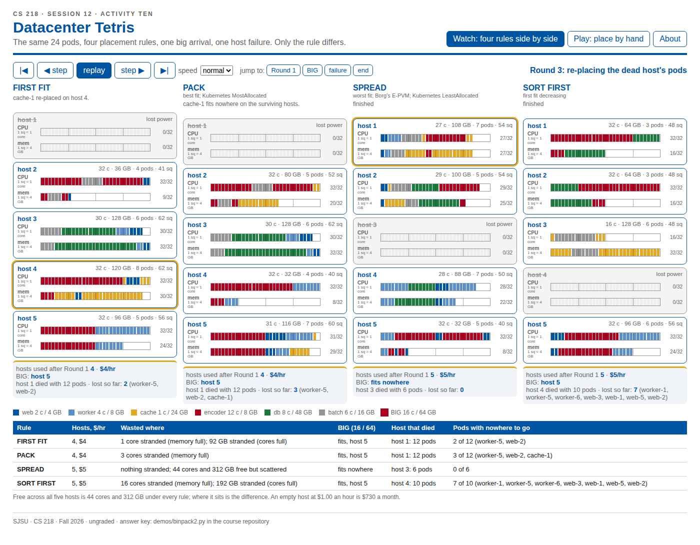

# Datacenter Tetris

CS 218, Topics in Cloud Computing, San José State University, Fall 2026. Session 12, Activity Ten.

The same 24 pods, four placement rules, one big arrival, one host failure. Only the rule differs.



## Run it

In the browser, at the GitHub Pages URL for this repository (Settings, Pages, once enabled). Or on your own machine:

```
git clone <this repository>
cd cs218-datacenter-tetris
npm install
npm run dev
```

`npm run check` re-runs the four rules and compares every board with the course's answer key.

## What it shows

Bin packing: given items of different sizes and bins of one fixed capacity, place every item using as few bins as possible. Here the items are pods with two sizes at once (cores and GB), the bins are hosts (32 cores, 128 GB), and every host in use costs $1.00 an hour. No known method finds the fewest bins quickly as the number of items grows, so every real scheduler uses a rule of thumb, and the question is which rule and what it costs when it is wrong.

**Watch** runs four rules on the same 24 pods in the same order, then hands each one a BIG pod (16 cores, 64 GB), then kills each one's busiest host and re-places its pods on the survivors. Step through it or let it play. The scoreboard at the end is the trade-off table from the lecture. The fleet size is adjustable (2 to 8 hosts; the activity is 5): with fewer than four hosts no rule can place the whole deck, and the pods that fit nowhere are shown as pending, the way Kubernetes leaves a pod unscheduled when no node has room for its requests.

**Play** lets you pick a rule and place each card by hand. After every card the app says what the rule would have done, and moves the pod there, so your board stays comparable to the key. It counts the placements that differed from the rule.

| Rule | In one sentence | Also called |
|---|---|---|
| FIRST FIT | try host 1, then 2, then 3...; place the pod on the first host where both bars have room | |
| PACK | of the hosts where it fits, the one whose filled squares (both bars added) will be highest afterwards; tie to the lowest number | best fit; Kubernetes `MostAllocated` |
| SPREAD | of the hosts where it fits, the one whose filled squares will be lowest afterwards; tie to the lowest number | worst fit; Borg's E-PVM; Kubernetes `LeastAllocated` (the default) |
| SORT FIRST | sort the deck by its bigger bar, largest first, ties in card order, then FIRST FIT | first fit decreasing |

## The dataset

Six pod shapes, 24 pods, 116 cores and 328 GB in total, so no packing can use fewer than ceil(max(116/32, 328/128)) = 4 hosts. The arrival order is Python's `random.Random(218)` shuffle from the course's `demos/binpack2.py`, written out in `src/deck.js` rather than re-shuffled, because the order is the experiment and JavaScript cannot reproduce Python's generator.

| pod | count | cores | GB |
|---|---|---|---|
| web | 6 | 2 | 4 |
| cache | 4 | 1 | 24 |
| encoder | 4 | 12 | 8 |
| worker | 6 | 4 | 8 |
| db | 2 | 8 | 48 |
| batch | 2 | 6 | 16 |

## The answer

| Rule | Hosts, $/hr | Wasted where | BIG | Host that died | Pods with nowhere to go |
|---|---|---|---|---|---|
| FIRST FIT | 4, $4 | host 2: cores full, 92 GB stranded | fits, host 5 | host 1, 12 pods | 2 of 12 |
| PACK | 4, $4 | 3 cores stranded | fits, host 5 | host 1, 12 pods | 3 of 12 |
| SPREAD | 5, $5 | nothing stranded; 44 cores and 312 GB free, scattered | fits nowhere | host 3, 6 pods | 0 of 6 |
| SORT FIRST | 5, $5 | 16 cores and 192 GB stranded | fits, host 5 | host 4, 10 pods | 7 of 10 |

Free across all five hosts is 44 cores and 312 GB under every rule; where it sits is the whole difference.

## Files

`src/deck.js` is the dataset. `src/rules.js` is the four rules and the three rounds, and is the answer key. `src/App.jsx` is the interface. `scripts/check.mjs` compares the rules' output with the expected boards. `.github/workflows/pages.yml` builds and publishes to GitHub Pages on every push to `main`.

## Sources

Verma, Pedrosa, Korupolu, Oppenheimer, Tune, Wilkes, *Large-scale cluster management at Google with Borg*, EuroSys 2015: https://research.google.com/pubs/archive/43438.pdf (section 3.2: stranded resources, E-PVM, best fit, the hybrid scorer).
Kubernetes scheduler configuration: https://kubernetes.io/docs/reference/scheduling/config/ (`LeastAllocated` is the default).
Kubernetes resource bin packing: https://kubernetes.io/docs/concepts/scheduling-eviction/resource-bin-packing/.
Christensen, Khan, Pokutta, Tetali, *Approximation and online algorithms for multidimensional bin packing: A survey*, Computer Science Review 2017: https://doi.org/10.1016/j.cosrev.2016.12.001.

MIT licence. Ungraded course material; the activity is worth nothing and the winner is worth nothing.
